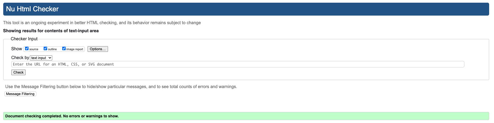

# mech-manager

# Knowledge Flow
(Developer: Gary Grant)


[View live website](https://bhero-battletech-inventory.herokuapp.com/)

## Table of Contents
0. [About](#about)
1. [Project Goals](#project-goals)
    1. [User Goals](#user-goals)
    2. [Admin Goals](#admin-goals)
2. [User Experience](#user-experience)
    1. [Target Audience](#target-audience)
    2. [User Requirements and Expectations](#user-requirements-and-expectations)
    3. [Project Management](#project-management)
    3. [User Stories](#user-stories)
    4. [Site Owner Stories](#site-owner-stories)
3. [Design](#design)
    1. [Colours](#colours)
    2. [Fonts](#fonts)
    3. [Project Structure](#project-structure)
    4. [Database](#database)
    5. [Data Models](#data-models)
    6. [Wireframes](#wireframes)
    7. [Agile Process](#agile-process)
4. [Technologies Used](#technologies-used)
    1. [Languages & Frameworks](#languages--frameworks)
    2. [Libraries and Tools](#libraries--tools)
5. [Features](#features)
6. [Future Features](#future-features)
    
7. [Validation](#validation)
    1. [CSS](#css)
    2. [Html](#html)
    3. [Javascript](#javascript)
    4. [Python](#python)
    5. [Chrome Dev Tools Lighthouse](#lighthouse)
    6. [WAVE Validation](#wave)  
8. [Testing](#testing)

9. [Bugs](#bugs)

10. [Deployment and Development Setup](#deployment-and-development-setup)
    1. [Heroku](#heroku)
    2. [Forking GitHub Repo](#forking-the-github-repository)
    3. [Clone a GitHub Repo](#clone-a-github-repository)
12. [Credits](#credits)
    1. [Code](#code)
    2. [Tutorials](#tutorials)
    3. [Imagery](#imagery)
13. [Acknowledgements](#acknowledgements)

## About

At our local Board Games Club we have a regular Battletech Mercenaries Campaign that uses a pool of shared minatures for a session. 
They players are grouped into 2 types, Player Characters and Games Masters (GMs).

Player Characters control individual Mechwarriors that pilot might battlemechs and are responsible for managing their own character progression records and battlemech minatures.

GMs generate an OpFor based on the Battle Value (BV) of the Mechwarriors and their Battle Mechs, the requirements of the Campaign and any additional Mechs available in the club.
As the Games Club meets weekly most of the work for a session needs to planned ahead of the meet.

As the club is inclusive of new players they are free to use any un-used Mech in a play session.
Unexpected players add BV to the player force and often GMs need a quick way to update their forces to ensure a balance.

This creates a situation where the GM and new players get bogged down in one of the many source books for the game trying to find suitable Mechs for the situation.
Compounding the issue is that while the source books offer a comprehensive background they can be intimidating to beginners which makes selecting a mech time consuming.

This App bridges that gap by allowing GMs (Commanders) to manage the available mechs based on the campaign needs and weather or not the minature is availabel for other players to use.

New players are free to register accounts and view all of the mechs in the club's inventory and get an idea of which mechs they would like to use based on what is currently available.

At this time, there is no requirment to manage the minature stock levels as games exceeding 6 mechwarriors are rare and the club can onlt support 1 Battletech game per meet. If scale is required at a later date then this requirment would be revised

***
## Project Goals
Primary goals of the project (web app):
- Give authorised users the ability to view some details about the the mechs available for our next battletech game.
- Enable Admin users (GMs) the ability to manage the battlemech records.
- Enable Site Owners to be able to View and edit records via the backend.
  

### User Goals
- Ability to View All mechs in the inventory
- Perform a download of board game assets for available mechs
- Be able to register an account with the app
- Be able to reset their password, if they register an email address in the application 

### Admin Goals
- Perform the same actions as a User
- Be able to create records for new Battlemechs
- Ability to amend and update content

### Site Owner
- Perform administartive tasks via the backend admin panel

## User Experience

### Target Audience
- Our Local Games Club, and prospective players that want to know which mech models are available for upcoming games.
- Individuals Interested in Battletech

### User Requirements and Expectations
- Application with a clear purpose
- An easy and intuitive user interface that allows efficient navigation
- A Responsive and visually good design
- Engaging content within the limits of set categories
- Ways to engage with the admin team.

##### Back to [top](#table-of-contents)

### Project Management

As the sole major stakeholder and developer on the project, an MVP based on SCRUM was not the ideal agile solution. Instead I opted for a Kanban approach in order to maintain a fully iterative approach to the development process.

As Kanban is designed to add value in a continous iterative process, once the MVP is in place there is flexibility on how and when new features, enhancements and bug fixes can be applied. 

Kanban supports CI/CD better than SCRUM in solo teams as there is no need to sprint plan, story priorities are reviewed regularly and offer a fluid way to apply the most value to the product without waiting until the end of a sprint.

As the main stakeholder, this means I am free to work on any story I deem the most important but in a real project this would need to undergo buisness review on a regular cadence.

### Epics

1. [Initial Setup](https://github.com/bovinehero/battletech-inventory/issues/1): the initial (non development) Environment set up. Stories here were largerly completed using refernce to Code Academy documents or work I'd completed in my Django Starter [repo](https://github.com/bovinehero/django-starter) 
2. [Basic CRUD setup for Pilots and Mechs](https://github.com/bovinehero/battletech-inventory/issues/10): covers the use case of players being able to access the content. This app included a lot of PoC research on the battle-tech inventory [repo](https://github.com/bovinehero/battletech-inventory). Much of this code was ported directly over to this repo. Ordinarily I would have blocked the battle-tech inventory [repo](https://github.com/bovinehero/battletech-inventory), however as it may be required for git history references as part of this project I have left it public.
3. [First Release](https://github.com/bovinehero/battletech-inventory/issues/6): work required to get an MVP release of the Project Application. As work progressed I had some difficulty producing a reliable deployment experience with Cloudinary and decided to start this repo to debug the issues. After a review of the concept at the games club the feedback was that as players managed their own characters Mechs were the only components the players cared about. And so the orginal MVP scope was reduced to only include Mechs.

### User stories

I took the view of comprehensive stories broken down into specific tasks, in hindsight the user stories may have been too vauge as many of the tasks took long enough to merit being their own story.

1. [Setup Heroku](https://github.com/bovinehero/battletech-inventory/issues/2): As a Developer I need a remote hosting solution for the application so that build and test on a prod-like env.
2. [Setup CMS](https://github.com/bovinehero/battletech-inventory/issues/3): As a Developer I need a remote CMS to host static content for the application so that build and test on a prodlike env.
3. [Setup Remote dB](https://github.com/bovinehero/battletech-inventory/issues/4): As a Developer I need a remote db to facilitate as a preprod/prod environment so that build and test on a prodlike env.
4. [Django Base Setup](https://github.com/bovinehero/battletech-inventory/issues/5): As a developer I need my base django dev env configured so that I can begin devlopement - this story leveraged work I'd already completed in setting up the Django Starter [repo](https://github.com/bovinehero/django-starter)
5. [Admin app setup](https://github.com/bovinehero/battletech-inventory/issues/8): As a site admin I need a basic admin panel setup so that perform admin functions and see visible results of models.
6. [Create Read Functionality on Pilots and Mechs](https://github.com/bovinehero/battletech-inventory/issues/11): As a battletech player I need a way to fetch information about pilots and mechs so that I can see which units are available for the campaign.
7. [Implement Update Functionality on Pilots and Mechs](https://github.com/bovinehero/battletech-inventory/issues/12): As a battletech player I need a way to edit information about my pilots and mechs so that I can change the pilot and mech details as the campaign progresses.
8. [Implement Create/Delete new Pilot and Mech functionality](https://github.com/bovinehero/battletech-inventory/issues/13): As a battletech GM I need a way to create/delete pilots and mechs so that as the campaign progresses I can recruit new pilots and mechs.
9. [Setup frontend](https://github.com/bovinehero/battletech-inventory/issues/14):
As a battletech player I need a way to easily navigate around the site so that I can interact with pilot and mech details.

## Design
***
### Colours
The Color pallet was created using [Coolors.co](https://coolors.co/) based off of the colours identified in the landing page's hero image.
<details><summary>See colour pallet</summary>

</details>

### Fonts

For this project I've elected to utilise the standard Bootstrap typography.

## Project Structure 

#### Web app  pages
A Clean, light theme with emphasis on shades of brown anf yellow was used troughout entire project. In addition the use of responsive and simple navigation allows th users to easily traverse the site.

#### Sections:
1. Home page: Landing page for the site, contains animated hero image links out to both board and video game retailers as well as an image carousel of the available mechs
2. Auth Forms: Form control for log in, logout, reset/forgot password and register accounts
3. Mech List View: 3 coloumn responsive table with 2 views depending on authorisation level. Read only view allows registered users to examine all the mechs in the dB and dives into greater detail. PDF downloads of record sheets are available. Commander level accounts have access to an activation toggle and can delete/edit records from an actions dropdown.
4. Detail Page: This allows users to view all the game level information, and if the mech is active a view into the record sheet. Commander level accounts are also provided links to Edit and Delete the selected Mech. 
5. Edit Page: Commander level accounts can edit exisiting mech records here
6. Create Page: Commander level accounts can create new mech records here
7. Delete Page: Commander level accounts can delete exisiting mech records here
8. 403/404/500 Pages: Custom error pages for the application should the redirections fail or the app experience an irrecoverable fault.  

### Code structure
Project code structure is organized and divided into a core app and a webapp app.

#### Project Apps:
- Core app - I use the convention of a core app to manage the django functionality to provide a uniformity in all my django projects. This allows me to use my [django-starter](https://github.com/bovinehero/django-starter) repo as a quickstart basis for new django projects. This keeps the core app functionality for the webserver in a single app and allows reuse in other projects with modificatios to the `settings.py` file contained within.

- WebApp app: This contains the main app for the site and as such full CRUD functionality is supported at various levels of authentication. Two user classes are supported, the ReadOnly registerable "Mechwarrior" account and the Full CRUD enabled "Commander" account. New Commander Accounts cannot be registered in the front end, for the time being they can only be allocated in the admin app

- Admin App: This app provides Site Owner backend management services.

#### Non app Directories:
- **.github**: Contains github issue type artifact for use in projects.
- **.venvc**: Directory created during development which contains a local copy of all project dependencies.
- **static**: Directory with the base CSS, and Image files. All unique JavaScript functionality outside of the included 3rd party frameworks is included inline on a per template basis. 
- **templates**: Contains all the HTML templates used in the project
- **.gitignore**: File with all the information on items git should ignore
- **env.py**: COntains the env secrets required to runt the app, should be defined in the initial stages of development.
- **Procfile**: This file advises Heroku which commands should be run when it is deployed.
- **manage.py** django wrapper script to help manage the project.
- **requirements.txt**: This file lists the dependencies required for the Django project to run.
- **runtime.txt**: This file advises Heroku which buildback is required to run the app. It is set to python 3.9.16 as the local development env is python 3.9.

##### Back to [top](#table-of-contents)

## Database
***
For this project I used PostgreSQL for the relational database management system.

In the initial stages of the design I'd envisioned managing the mechs on a by pilot basis. Indeed the first PoC app developed inthe [battletech-inventory repo](https://github.com/bovinehero/battletech-inventory) included plans to manage the Mech "Entity" as part of a related pilot:

<details><summary>Original (ERD)Physical Database Model</summary>

</details>

As part of the work I created a specific [branch](https://github.com/bovinehero/battletech-inventory/tree/read-all-the-things) to build the PoC code around 

I then toyed with the idea of 

<details><summary>Second Iteration Database Model</summary>

</details>

- The model showed on the diagram visually represents the structure of a PostgreSQL database, including tables, columns, relationships, and constraints, that is actually stored in the database itself.

### Custom Data Models

#### Mech model

| Name          | dB Key       | Type         | Represents
| --------------| ------------ | ------------ | ----
| Name          | name         | CharField    | The unique unit identifier | 
| Category      | category     | IntegerField | WHich chassis type the mech is |
| weight        | weight       | IntegerField | how heavy the unit is in tons |
| Tech Level    | tech_level   | IntegerField | which tech base the unit belongs in |
| Role          | role         | IntegerField | typical battlefield role for the unit |
| Slug          | slug         | SlugField    | slug url |
| description   | description  | TextField    | Some information about the mech |
| Record Sheet  | record_sheet | CharField    | reference for the url locator for the downloadable mech sheet| 
| Image         | image        | CharField    | reference for the url for a profile pic of the mech |
| Battle Value  | battle_value | IntegerField | How manay points it costs to use the model |
| Status        | status       | IntegerField | If the mech can be used |


The Mech Model represents a programitical version of an available minature that any club memeber can use. 

##### Back to [top](#table-of-contents) 

### Wireframes

TODO
<details><summary>Home page</summary>


</details>

<details><summary>authentication pages(Login,register,logout,password reset and password reset done)</summary>


</details>


<details><summary>Mech Detail</summary>


</details>

<details><summary>Edit & Create Mech</summary>


</details>

<details><summary>Delete Mech</summary>


</details>

***

## Agile Process

### About
I understood the requirement from the assignment perspective of including an agile project management framework in this deliverable. As a qualified scrum master and kanban practitioner I felt the Sprint based SCRUM model was an ill fit for my needs here.

As a solo developer any scrum based rituals would not be required, indeed many of the processes would add unessessary weight to the project execution.

Instead I opted to follow the a service based Kanban model. As a solo developer I am able to re-evaluate story prioirty and define my own definition of done as required. I am also the end customer, so at the completion of a story I can immediatley evaluate if I have delivered on the acceptence criteria and feed back to myself which additional items are required to complete the tasks.

The main advantage I find with using Kanban over SCRUM is the flexibilty on milestones. Kanban utilises iterative planning so milestones represent project roadmap items. As the only delivereble roadmapped for this project is the submission date I defined the project delivery as the only milestone.  

Within the project milestone EPICs represent the work required to complete significant steps for the milestone, stories are the context for the work and within each story there are a collection of tasks wich map to acceptence criteria.

### Kanban Cards

Using the  Github issues feature I created the followng templates:

- [User Story Template](mech-manager/.github/ISSUE_TEMPLATE/bug-report.md)
- [Epic Template](mech-manager/.github/ISSUE_TEMPLATE/epic.md)
- [Bug Report Template](mech-manager/.github/ISSUE_TEMPLATE/user-story.md)


I implemented T-Shirt Sizing instead of Fibonacci sizes as (In my experience) Fibonacci sequencing tends to turn into an association with timeboxing, where as the more abstract T-Shirt sizes is associated directly with inputted effort:

- __Shirt Size Small:__ effort estimate of < 1/2 day
- __Shirt Size Medium:__ effort estimate of < 1 day but > 1/2 day
- __Shirt Size Large:__ effort estimate of < 3 days but > 1 day
- __Shirt Size Xtra Large:__ effort estimate of > 3 days
- __Shirt Size Xtra Xtra Large:__ should have been an epic

Tshirt sizing is implemented as an estimate in the beginning as part of a definition of Ready, but also updated in an item's definition of Ready for Release.

I also included a blocked label for times when stories could not progress due to unforseen circumstances:

- __BLOCKED:__ task cannot progress due to issue in comments

### Kanban Board

The [kanban board](https://github.com/users/bovinehero/projects/4/views/1) provides a view into the progress of the work.

With Kanban all work is iterative and so any project ideas issues or requests are dropped into the backlog Column. 

Items undergo analysis and are placed into Ready Column once the card is completed. 

In a team, the Product Owner and Buisness Analysts typically work with stakeholders to prioiritse the order of items in the ready column so that a free developer can pick up the next most important work based on the position on the board. 
As the sole stakeholder and developer on the project I have complete freedom to decide the order of prioirty here, but in a real project this responsibility can be handed off to buisness facing team members. 
These people can work towards understanding requirements on befalf of developers and provide developers insight into the expectations of the buisness.

This frees up developers to continue to focus on delivering stories as stakeholder management can be handed off to the buisness analysts. In cases where a BA needs developer / stakeholders to directly comminucate, the BA can arrange a session and drive the discussion towards a definition of Ready for developers.

Items that are in progress are currently being worked on, and will be manged by Work in Progress (WIP) limits. Since I am sole developing there are no WIP limits.

Items in Testing are typically undergoing Integration & UAT testing with a peer review, as a single developer this phase represents a project item that has been commited but is undergoing local or remote testing.

Items in Ready for release are finished active development but are not currently deployed into production.

Items athat are Done are live.

#### Closing words on agile:
Agile project management involves breaking the project into phases and emphasizes continuous collaboration and improvement. As this is an emulated project envrionment collaboration is not a reasonable item that can be measured.

The project consisted of 3 main phases:

1. Initial Setup - Setup of initial repo and prod dependencies
2. Basic Crud Setup - Coding of the basic functionality
3. First Release - Productionisation of app with User Access Controls (UAC)

Each phase represented an epic and contained 1 or more stories defined with implementation tasks.

After the initial release and completion of the first milestone, our workflow becomes a regular inclusion of improvemnts, bug reporsts or new feature requests. 

This allows us to work towards an easy way to implement improvements via Continuous Integration and Continuous Delivery (CICD) within a larger software development team.

##### Back to [top](#table-of-contents)    
***

## Technologies Used

### Languages & Frameworks

- HTML 
- CSS
- Javascript
- Boostrap 4
- Python 3.9.2
- Django 3.2 (LTS)

### Libraries & Tools

- [Am I Responsive](http://ami.responsivedesign.is/) was used testing responsive vies and image at top of the page.
- [Balsamiq](https://balsamiq.com/) to create the projects wireframes
- [Bootstrap 4.2](https://getbootstrap.com/). This project uses the Bootstrap library for UI components.
- [Lucidcharts](https://lucid.app/) has been used in  project to design and document data model architecture.
- [Favicon.io](https://favicon.io) for making the site favicon
- [Chrome dev tools](https://developers.google.com/web/tools/chrome-devtools/) was used for debugging of the code and checking site for responsiveness
- [Font Awesome icons](https://fontawesome.com/) - Icons from Font Awesome icons  were used throughout the site
- [Git](https://git-scm.com/) was used for version control within VSCode to push the code to GitHub
- [GitHub](https://github.com/) was used as a remote repository to store project code
- [Google Fonts](https://fonts.google.com/) - for typography in project
- [crispy-forms](https://django-crispy-forms.readthedocs.io/en/latest/) for the basis of bootstrap styled django forms
- [whitenoise](https://whitenoise.readthedocs.io/en/latest/) to deal with staticfiles as my cloudinary implementaion did not work as planned
- [postgres15](https://www.postgresql.org/) was used for testing dB models options and compiling the dB dependencies.
- [ElephantSQL](https://customer.elephantsql.com/instance) for hosting the production dB
- [allauth](https://django-allauth.readthedocs.io/en/latest/) for handling all the auth 
- [Sendgrid](https://sendgrid.com/) to allow the app to communicate to users via email
- [Heroku](https://dashboard.heroku.com/apps) for hosting the application

## Features

***

TODO

### Feature N

Description:

User Stories In Feature:

<details><summary>See Feature Screen Shots</summary>


</details>

Manual Testing
<details><summary>See Testing Results</summary>


</details>

## Future Features
***
For further releases of this web, there is a plan to implement new and improve
some of the existing features

1. Image Upload: I had difficulty getting cloudinary working and was unable to develop a mech profile picture or recordsheet upload, this feature would mean that users would no longer rely on the site owner providing these assets via releases.
2. User validation: Currently users can sign up via email, it would be good if the users had to provide MFA and activate accounts via email prioir to accessing the site.
3. Commander Invitations: Commander level access is only available via backend edits to user accounts. This is primarily due to the lack of user validation as currently it is a risk to allow newly registered users full CRUD access to the site without a vetting system.
4. Campain Manager: Include options for mutiple caompains to run from the same inventory
5. Inventory / Order system: Include options for multiple inventories and stock management.

##### Back to [top](#table-of-contents)

## Validation:
***

### Html
[WC3 Validator](https://validator.w3.org/) was used to validate the html in the project. 

+ Index.html [results](https://validator.w3.org/nu/?showsource=yes&showoutline=yes&showimagereport=yes&doc=https%3A%2F%2Fbhero-battletech-inventory.herokuapp.com%2F) - No Errors Found
+ Sign In [results](https://validator.w3.org/nu/?showsource=yes&showoutline=yes&showimagereport=yes&doc=https%3A%2F%2Fbhero-battletech-inventory.herokuapp.com%2Fmechs%2F)

Urls behind auth were tested via text input on the Nu HTML Checker
<details><summary>mech_delete.html - No Errors Found</summary>

</details>

<details><summary>mech_detail.html - No Errors Found</summary>

</details>

<details><summary>mechs_form.html - No Errors Found</summary>

</details>

<details><summary>mechs.html - No Errors Found</summary>

</details>

<details><summary>new_mechs_form.html - No Errors Found</summary>

</details>


### CSS
[Jigsaw W3 Validator](https://jigsaw.w3.org/css-validator/)was used  to validate the css in the project. 
main.css [results](https://jigsaw.w3.org/css-validator/validator?uri=https%3A%2F%2Fbhero-battletech-inventory.herokuapp.com%2Fapp%2Fstaticfiles%2Fcss%2Fmain.css&profile=css3svg&usermedium=all&warning=1&vextwarning=&lang=en) - No Error Found.


### Javascript
[JShint](https://jshint.com/) was used to validate custom scripts included in the templates. 

<details><summary>Messages Handler - 1 N/A error</summary>

</details>

Threw one error of undefined variable `bootstrap`, this is not an issue as the variable is defined in the bootstrap import on the __base.html__ template

<details><summary>403/404/500 Error handler - No Errors Found</summary>

</details>

### Python
[CI Python Linter](https://pep8ci.herokuapp.com/) to check  Python code for validity and conventions

settings.py returned the following errors:
+ 89: E501 line too long (91 > 79 characters)
+ 92: E501 line too long (81 > 79 characters)
+ 95: E501 line too long (82 > 79 characters)
+ 98: E501 line too long (83 > 79 characters)

As these are django generated values for `AUTH_PASSWORD_VALIDATORS` I've decided to accept these as an exception to the validator

+ pep8 linter in VSCode


### Lighthouse

TODO

+ [Lighthouse](https://developers.google.com/web/tools/lighthouse/) for performance, accessibility, progressive web apps, SEO analysis of the project code here are the results:

<details><summary>index.html</summary>

</details>

<details><summary>mech_delete.html</summary>

</details>

<details><summary>mech_detail.html</summary>

</details>

<details><summary>mechs_form.html</summary>

</details>

<details><summary>mechs.html</summary>

</details>

<details><summary>new_mechs_form.html</summary>

</details>

### Wave
The WAVE WebAIM web accessibility evaluation tool was used to ensure the website met high accessibility standards.

index.html [results](https://wave.webaim.org/report#/https://bhero-battletech-inventory.herokuapp.com/) - no errors

Urls behind auth were tested via the WAVE [plugin](https://chrome.google.com/webstore/detail/wave-evaluation-tool/jbbplnpkjmmeebjpijfedlgcdilocofh) on chrome


<details><summary>mech_delete.html</summary>

</details>

<details><summary>mech_detail.html</summary>

</details>

Contrast error due to default bootstrap theme on "available" pill - accepted as this is vanilla bootstrap theme.

<details><summary>mechs_form.html</summary>

</details>

<details><summary>mechs.html</summary>

</details>

<details><summary>new_mechs_form.html</summary>

</details>

Alerts were due to 
1. redundant links in name column and in the Actions Menu drop downs - accepted as links in the name column were added as convenience.
2. pdf downloads being untestable - accepted as these are third party

<details><summary>new_mechs_form.html</summary>

</details>


## Testing
***

### Browser Compatibility
The website was tested on the following browsers:

1. Google Chrome
2. Mozilla Firefox

### Testing

In order to preserve the prod db, in testing I used a sqlite.db by changing the __DATABASES__ variable in `settings.py` to the following:

``` py
DATABASES = {
    "default": {
        "ENGINE": "django.db.backends.sqlite3",
        "NAME": os.path.join(BASE_DIR, "db.sqlite3"),
    }
}
```

the Django test suite can then be executed via:

``` sh
coverage run --source=webapp manage.py test
```

The unnitest suite shows 100% testing coverage via:

``` sh
coverage report
```


### Testing User Stories

TODO

1. User Story

| **Feature** | **Action** | **Expected Result** | **Actual Result** |
|-------------|------------|---------------------|-------------------|
| reference feature above | What to do | What should happen  | Works as expected |


## Bugs
***
TODO
Following Bugs are found during the development of this project

1. Bug 1
2. Bug 2
3. Bug 3

## Deployment and Development Setup
***

### Development ENV Setup

The app development documentation assumes a local setyp on a UNIX like system,while untested development on windows should be supported provided you adapt the process for a windows system.

We use a local install of postgresql for new dB development to avoid breaking upstream development and prod envs. 

Postgresql is available [here](https://www.postgresql.org/download/)
We are using version 15 to align with the current prod db version.

In order to promote env isolation we use __virtualenv__ to create a unique python env for this application.

__virtualenv__ is available [here](https://pypi.org/project/virtualenv/) if you do not have it installed.

#### First time setup

Clone the repo:

``` sh
git clone git@github.com:bovinehero/battletech-inventory.git
```

Create a __Python 3.9.6__ environment

``` sh
cd battletech-inventory
python3 -m virtualenv --python=python3.9.6 .venv
```

Activate the environment

``` sh
source .venv/bin/activate
```

The requirements.txt specifies __psycopg2__ as a dependency. When installing on certain environments psycopg2 needs the posgresql __pg_config__ in it's PATH, so either make sure to add it to your venv or export it prior to installing the requirments.
Example for MacBook on the PostgreSQL default install location:

``` sh
export PATH=/Library/PostgreSQL/15/bin/:$PATH
```

Missing this step will cause the pip execution to fail if the binary can't be found. 

Install the app dependencies

``` sh
pip install -r requirements.txt
```

### Local sqlite3 db and env.py setup

Provided you have a dev environment set up as below the following can be used to set up a new local dB __db.sqlite3__ for the web app:

``` sh
python manage.py migrate
python manage.py createsuperuser
```

The convention for the repo is to use an __env.py__ at the repository root to manage the env variables when using a full install

``` py
import os

# env variables
os.environ["DATABASE_URL"] = ''
os.environ["SECRET_KEY"] = ''
os.environ["CLOUDINARY_URL"] = ''
os.environ["SENDGRID_API_KEY"] = ''
os.environ["FROM_EMAIL"] = ''

# local db superuser and pass
super_user = ''
super_pass = ''
```

When deployed on a managed compute platform (like heroku) use ENV variables injected into the container creation process during the deployment/provisioning.

Performing the above actions creates the basic file structure used in the repo and gives us a local sqlite dB to play with.

The variables and their usage is described in the __Heroku Deployment__ section below

the __db.sqlite3__ file is not contained in the downloadable repo, it will need to be re-created manually.


``` sh
python manage.py makemigrations
python manage.py migrate
python manage.py createsuperuser
```

#### Secret Key Gen

The default secret key for Django is insecure, to create a new one for __env.py__ run the following in your venv:

``` sh
python manage.py shell
```

Import the django secrets module and create a new key:

``` py
from django.core.management.utils import get_random_secret_key
print(get_random_secret_key())
```

Paste the result in your __env.py__ file like so:

``` py
os.environ["SECRET_KEY"] = 'django-example-^)3iq0)e@#$25%$e_8l_e5(rj&szl=f(jq^m628yx+k2_lcp27'
```

### Heroku Deployment

Full refernce docs for heroku are [here](https://devcenter.heroku.com/categories/reference)

The main noticible configuration component is the env vars to towit the Heroku environment requires the following settings copied from the local __env.py__ file:

__DATABASE_URL__ = `postgres://<username>:<password>@<db_url>/<namespace>`
I am using a free tier ElephantSQL for the solution, however any posgres solution could be used as an alternative. Postgres 15 has been tested locally and should work with the application.

__SECRET_KEY__ = created as per the Secret Key Gen process above __SHOULD BE DIFFERNET KEY FROM LOCAL ENV__

__CLOUDINARY_URL__ = `cloudinary://<user id>:<password>@d<namespace>` Not strictly required as the solution leverages whitenoise for static files, however for future enhancements involving recordsheet and image uploads a CDN solution will be required.

__SENDGRID_API_KEY__ = Provided by sendgrid for use in app to user communication.

__FROM_EMAIL__ = The email address all coms FROM the app will be sent from, used with SENDGRID.

In addition heroku needs a __PORT__ = 8000 variable set to provide the service.

Deployments are set up to run manually from the main branch, logging into heroku and selecting deploy branch should start a build

### How to Fork
To fork this repository:

1. Go to the repository for this project.
2. Click the Fork button in the top right corner.

### How to Clone
To clone this repository:

1. Go to the repository for this project.
2. Click on the code button, select whether you would like to clone with HTTPS, SSH or GitHub CLI and copy the link shown.
3. Open the terminal in your code editor and change the current working directory to the location you want to use for the cloned directory.
4. Type 'git clone' into the terminal and then paste the link you copied in step 3. Press enter.

## Credits

### Code

While all (re)used code is credited inline I'd like to acknowledge the following sites for inspiration outside of the official docs for each library/framework used.

1. [W3 Schools](https://www.w3schools.com/)
2. [Mozilla mdn_ docs](https://developer.mozilla.org/en-US/)
 
### Tutorials 

The Code Institute __Hello Django__ and __I Think Therefore I Blog__ tutorials both provided fantastic insight into how to build, test and deploy this application.

[Web Forefront](https://www.webforefront.com/django/permissionchecks.html) was a great supplementary resource for django permissions managment

### Imagery

All Imagery and PDFs provided by resources on the [SARNA Battletech Wiki](https://www.sarna.net/) under GFDL license

## Acknowledgements

***

I would like to acknowledge the following people & orginisations that helped me along the way in completing this project:

Ed Bradly - for his insights into django, and being a person to bounce technical isdes off of.

Roman Rakic - for his readme template, it really helped to make sure I covered the bases for documentation.

The folks that play the regular campaign - for their feedback and direction on what "we" needed first.

Mo Shami - for being the mentor that set me on the right path and provided me with mid and final feedback prioir to submission.

[Catalyst Game Labs](https://www.catalystgamelabs.com/brands/battletech) for the record sheets (hosted on SARNA) and fro bringing back Battletech.

[SARNA Battletech Wiki](https://www.sarna.net/) for being such an awesome resource for information and content for the dB.